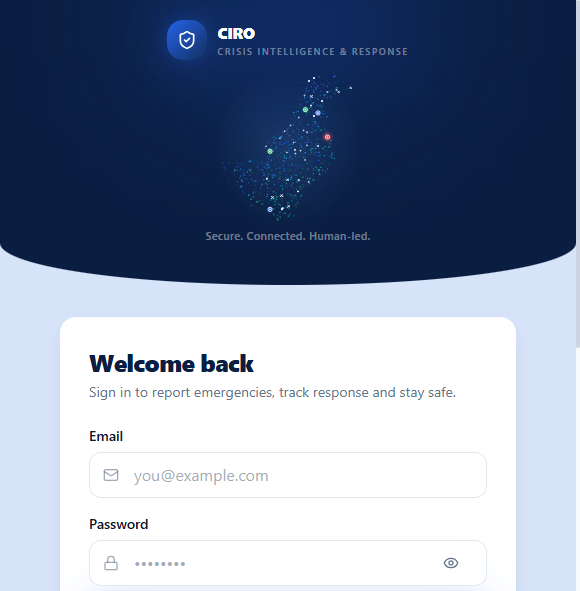
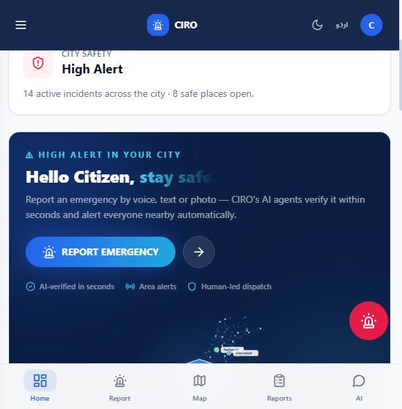
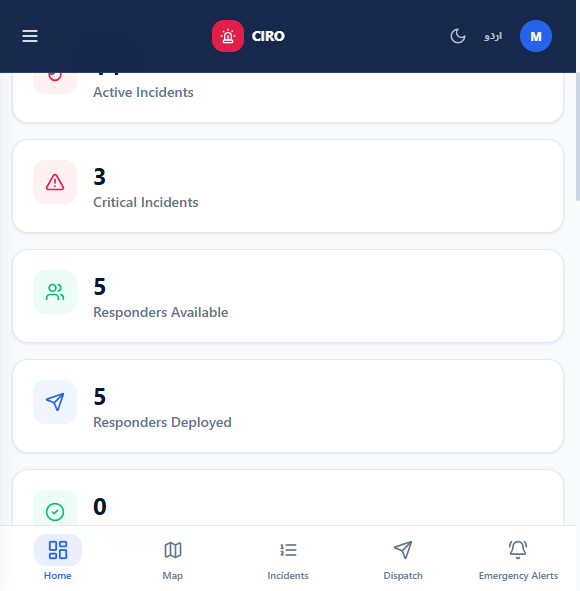

# 🚨 CIRO — Crisis Intelligence & Response Orchestrator

[](https://react.dev)
[](https://vitejs.dev)
[](https://nodejs.org)
[](https://expressjs.com)
[](https://sqlite.org)
[](https://tailwindcss.com)
[](https://capacitorjs.com)
[](https://firebase.google.com)
[](https://netlify.com)
[](https://railway.app)
[](documentation/4-TECHNICAL-FLOW.md)
[](documentation/1-FEATURES.md)
[](documentation/1-FEATURES.md)
[](documentation/6-HACKATHON-PRESENTATION.md)

**Secure. Connected. Human-led.**

One safety grid for Pakistan: citizens, responders and command centers connected by an
**AI-verified emergency pipeline** that reacts in seconds — while **humans keep final authority**.

> 🏆 Built for the **Alibaba Cloud × Bano Qabil Hackathon**

---





---

## ✨ Highlights

| | |
|---|---|
| 🗣️ **Voice-to-Report** | Speak in Urdu / Roman Urdu / English — AI fills the form |
| 🤖 **10-Agent AI Triage** | Spam, duplicate, geo & satellite verification in **< 5 seconds** |
| 👮 **Human Approval Gate** | AI recommends; dispatchers approve — fully audit-logged |
| 📡 **Realtime** | WebSocket alerts, ETA pushes, live status timelines |
| 📱 **Cross-platform** | Web + Android APK + iOS from a single codebase |
| 🌙 **Accessible** | Dark mode, 3 languages, citizen-first UX |

---

## 🚀 Live Links

| Platform | URL |
|----------|-----|
| 🌐 Website | https://ciroquick.netlify.app |
| ⚙️ API | https://bano-qabil-alibabacloud-hackthon-ciro-app-production.up.railway.app |
| 📦 Repo | https://github.com/saqib54/Bano-Qabil-AlibabaCloud-Hackthon-CIRO-APP |
| 📱 APK | `client/android/app/build/outputs/apk/debug/app-debug.apk` |

### 🔑 Demo Accounts

| Role | Email | Password |
|------|-------|----------|
| Citizen | `citizen@ciro.demo` | `Ciro@1234` |
| Responder | `responder@ciro.demo` | `Ciro@1234` |
| Admin | `msaqibali433@gmail.com` | `saqib@23` |

---

## 🏗️ Architecture

```
┌────────────┐    ┌────────────┐    ┌────────────┐
│  Citizen   │    │  Responder │    │   Admin    │
│  Web / APK │    │   Portal   │    │  Command   │
└─────┬──────┘    └─────┬──────┘    └─────┬──────┘
      │  HTTPS REST + WebSocket  │            │
      └──────────────┬───────────┴────────────┘
              ┌──────▼──────┐
              │  CIRO API   │  Express • 82 endpoints
              │  (Railway)  │  JWT + Firebase Auth
              └──────┬──────┘
      ┌──────────────┼──────────────┐
┌─────▼─────┐ ┌──────▼─────┐ ┌──────▼──────┐
│  SQLite   │ │ 10-Agent   │ │  WebSocket  │
│ incidents │ │ AI Triage  │ │  realtime   │
└───────────┘ └────────────┘ └─────────────┘
```

**Frontend:** React 18 · Vite · Tailwind · Zustand · TanStack Query · Leaflet
**Backend:** Node 20 · Express · better-sqlite3 · ws
**Mobile:** Capacitor 8 (Android + iOS) · native Google sign-in
**Auth:** JWT rotation · Firebase Google sign-in · Email OTP

---

## 📚 Documentation

Full package in [`documentation/`](documentation/README.md):

| Document | Description |
|----------|-------------|
| [Features](documentation/1-FEATURES.md) | Complete feature matrix |
| [Screenshots](documentation/2-SCREENSHOTS.md) | Gallery of every portal |
| [User Flows](documentation/3-USER-FLOWS.md) | Diagrams for all personas |
| [Technical Flow](documentation/4-TECHNICAL-FLOW.md) | Architecture & API surface |
| [How We Built It](documentation/5-HOW-WE-BUILT-IT.md) | Specs, impact, differentiators |
| [Presentation](documentation/6-HACKATHON-PRESENTATION.md) | Hackathon deck |

Engineering detail: [PRD](docs/PRD.md) · [TRD](docs/TRD.md) · [App Flow](docs/APP_FLOW.md) · [Backend Schema](docs/BACKEND_SCHEMA.md)

---

## 🧑‍💻 Local Development

```bash
# 1. Backend (port 5000)
cd server
npm install
cp .env.example .env      # fill JWT secrets + API keys
npm run dev               # auto-migrates + seeds demo data

# 2. Frontend (port 5173)
cd client
npm install
npm run dev
```

Open http://localhost:5173 and sign in with any demo account above.

### Building the APK

```bash
cd client
npm run build
npx cap sync android
cd android
gradlew assembleDebug     # requires JDK 21 + Android SDK
# → app/build/outputs/apk/debug/app-debug.apk
```

---

## ☁️ Deployment

| Target | Host | Trigger |
|--------|------|---------|
| Website | Netlify (base dir `client`) | push to `main` |
| API | Railway (root dir `server`) | push to `main` |
| APK | Local Gradle build | on demand |
| API URL switching | `client/public/runtime-config.json` | no rebuild needed |

---

## 📄 License

Hackathon demonstration project — © Team CIRO.

---

*Made with ❤️ for Pakistan's emergency responders.*
