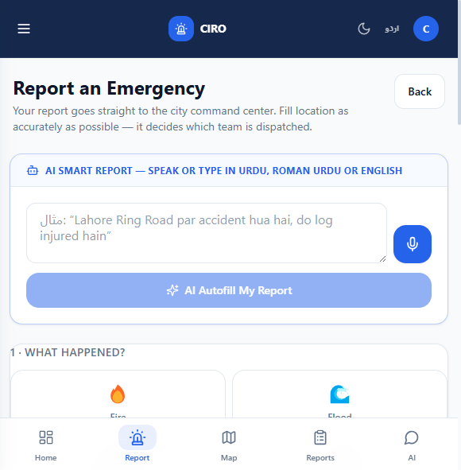
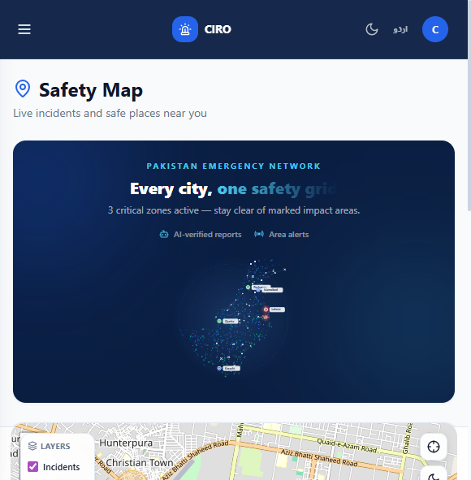
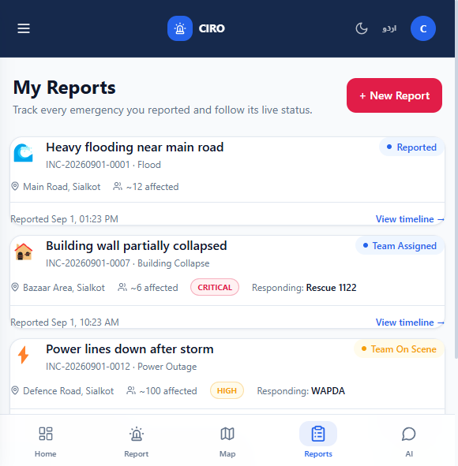
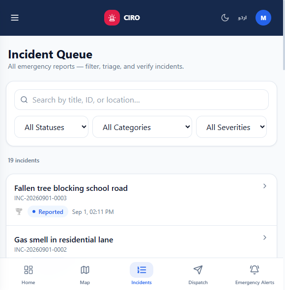
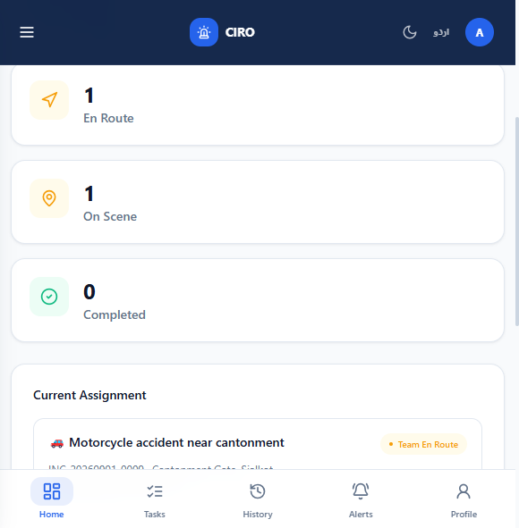

<div align="center">

<!-- ═══════════════════════════════════════════════════════════ HERO -->

<br/>


<br/><br/>

# Crisis Intelligence & Response Orchestrator

### *Secure · Connected · Human-led*

<p>
  One safety grid for Pakistan — citizens, responders and command centers<br/>
  connected by an <strong>AI-verified emergency pipeline</strong> that reacts in seconds,<br/>
  while <strong>humans keep final authority on every dispatch.</strong>
</p>

<br/>

<!-- ═══════════════════════════════════════════════════════ TECH BADGES -->

**Tech Stack**

[](https://react.dev)
[](https://vitejs.dev)
[](https://nodejs.org)
[](https://expressjs.com)
[](https://sqlite.org)
[](https://tailwindcss.com)
[](https://capacitorjs.com)
[](https://firebase.google.com)
[](https://zustand-demo.pmnd.rs)
[](https://leafletjs.com)

<br/>

**Deployment & Cloud**

[](https://ciroquick.netlify.app)
[](https://bano-qabil-alibabacloud-hackthon-ciro-app-production.up.railway.app)
[](https://alibabacloud.com)

<br/>

**Metrics & Features**


<br/>

[](documentation/6-HACKATHON-PRESENTATION.md)
[](https://ciroquick.netlify.app)

<br/>

> **Author: [Saqib Azair](https://github.com/saqib54)** &nbsp;|&nbsp; Alibaba Cloud × Bano Qabil Hackathon 2026

<br/>

</div>

---

## 📋 Table of Contents

- [What Is CIRO?](#-what-is-ciro)
- [Live Links & Demo Accounts](#-live-links--demo-accounts)
- [Feature Highlights](#-feature-highlights)
- [System Architecture](#-system-architecture)
- [The 10-Agent AI Pipeline](#-the-10-agent-ai-pipeline)
- [Three Portals](#-three-portals)
- [Screenshots Gallery](#-screenshots-gallery)
- [Security Posture](#-security-posture)
- [Local Development](#-local-development)
- [Mobile — Android APK & iOS](#-mobile--android-apk--ios)
- [Deployment](#-deployment)
- [Repository Structure](#-repository-structure)
- [Documentation](#-documentation)
- [Roadmap](#-roadmap)
- [License](#-license)

---

## 🚨 What Is CIRO?

**CIRO** (Crisis Intelligence & Response Orchestrator) is a **production-ready, full-stack emergency response platform** built specifically for Pakistan's crisis management ecosystem.

When a citizen reports an emergency — by **voice in Urdu**, by **photo**, or by **typing** — a **10-agent deterministic AI pipeline** verifies, geo-tags, deduplicates, satellite-fuses, and scores the report in **under 5 seconds**. A human dispatcher then reviews the AI verdict in the **AI Decision Center** and dispatches the right team with one click. Every step is **WebSocket-pushed** back to the citizen in real time and **logged to an immutable audit trail**.

```
👤 Citizen reports    →    🤖 10-Agent AI verifies (< 5s)    →    👮 Dispatcher approves    →    🦺 Team dispatched
       ↑                                                                                                   |
       └───────────── WebSocket: ETA · team details · live status ←─────────────────────────────────────┘
```

> **"AI recommends — humans decide."**  
> CIRO is not autopilot. It is AI amplification for human responders. No team moves without dispatcher approval.

---

## 🚀 Live Links & Demo Accounts

<div align="center">

| Platform | Link |
|----------|------|
| 🌐 **Web Application** | [ciroquick.netlify.app](https://ciroquick.netlify.app) |
| ⚙️ **REST API** | [bano-qabil-alibabacloud-hackthon-ciro-app-production.up.railway.app](https://bano-qabil-alibabacloud-hackthon-ciro-app-production.up.railway.app) |
| 📦 **GitHub Repository** | [saqib54/Bano-Qabil-AlibabaCloud-Hackthon-CIRO-APP](https://github.com/saqib54/Bano-Qabil-AlibabaCloud-Hackthon-CIRO-APP) |
| 📱 **Android APK** | `client/android/app/build/outputs/apk/debug/app-debug.apk` |

</div>

### 🔑 Demo Accounts

| Role | Email | Password | Access |
|------|-------|----------|--------|
| 👤 **Citizen** | `citizen@ciro.demo` | `Ciro@1234` | Report, track, safety map, weather, alerts |
| 🦺 **Responder** | `responder@ciro.demo` | `Ciro@1234` | Assignments, field ops, situation logs |
| 🖥️ **Admin / Dispatcher** | `msaqibali433@gmail.com` | `saqib@23` | Full command center, AI triage, analytics |

> **Google Sign-in** and **Email OTP** are also available on all accounts.

---

## ✨ Feature Highlights

| # | Feature | Detail |
|---|---------|--------|
| 🗣️ | **Voice-to-Report** | Speak in Urdu / Roman Urdu / English — AI fills the form automatically with category, location, people count, priority, and suggested team |
| 🤖 | **10-Agent AI Triage** | Spam · Geo · Satellite · Dedup · Verdict · Impact · Dispatch chain in **< 5 seconds** — deterministic, explainable, per-agent auditable |
| 👮 | **Human Approval Gate** | AI recommends only; a dispatcher must approve before any team moves — every decision is audit-logged with actor ID and timestamp |
| 📡 | **Real-time WebSocket** | Live ETA push, status updates, emergency alerts, and dispatch notifications — all < 300 ms latency |
| 🗺️ | **Operations Map** | Severity-pulsed pins, impact-zone polygons (sector/corridor/circle), forecast hotspot rings, shelter markers, tactical dark tiles |
| 📱 | **Cross-Platform** | Web + Android APK + iOS from a **single React codebase** via Capacitor 8 |
| 🌍 | **3-Language Support** | Urdu, English, Roman Urdu — runtime switch, no page reload, synced server-side |
| 🌙 | **Dark / Light Mode** | System-aware + manual toggle; preference synced to user account |
| 🔐 | **Secure by Design** | JWT rotation, RBAC on every route, bcrypt, rate limiting, OTP hardening, audit log |
| 🩺 | **Medical Privacy** | Medical impact zones are team-only — zero public exposure, affected count stored as 0 |
| 📊 | **AI Forecasting** | Historical hotspot clustering on 2 km grid; risk = min(100, count×14 + weight×6) |
| 📡 | **Satellite Signal Fusion** | SatelliteScout: FIRMS/Sentinel-1 simulation for fire, flood, landslide — adjusts confidence ±6/12 |
| 🤝 | **Smart Dispatch** | TEAM_MATRIX per category + ETA = clamp(4 + dist/800m, 4, 15) min — persisted to incident |
| 💬 | **Copilot Summary** | 3-line plain-language dispatcher summary per report with all key facts |

---

## 🏗️ System Architecture

```
┌───────────────────┐    ┌─────────────────────┐    ┌──────────────────────┐
│   CITIZEN         │    │   RESPONDER          │    │   ADMIN / DISPATCHER │
│   Web · APK · iOS │    │   Staff Portal       │    │   Command Center     │
└────────┬──────────┘    └──────────┬───────────┘    └──────────┬───────────┘
         │                          │                            │
         │           HTTPS REST (/api/v1)  +  WebSocket (ws)    │
         └──────────────────────────┬────────────────────────────┘
                                    │
                        ┌───────────▼───────────┐
                        │      CIRO API          │
                        │  Express · Port 5000   │
                        │  82 endpoints          │
                        │  JWT + Firebase Auth   │
                        │  RBAC · Rate Limiting  │
                        └─────────┬─────────────┘
          ┌──────────────┬────────┴──────────┬──────────────────┐
          │              │                   │                  │
  ┌───────▼──────┐ ┌─────▼──────┐  ┌────────▼──────┐  ┌───────▼──────┐
  │  SQLite DB   │ │ 10-Agent   │  │  WebSocket    │  │  Alibaba     │
  │  WAL mode    │ │ AI Triage  │  │  Hub          │  │  DashScope   │
  │  18 tables   │ │ Pipeline   │  │  Registry     │  │  Qwen AI     │
  │  10 migrat.  │ │ < 5 s      │  │  < 300 ms     │  │  (optional)  │
  └──────────────┘ └────────────┘  └───────────────┘  └──────────────┘
```

### Tech Stack

| Layer | Technology | Purpose |
|-------|-----------|---------|
| **Frontend Framework** | React 18 + Vite 5 | SPA with concurrent rendering; sub-second HMR |
| **Styling** | Tailwind CSS 3 | Design tokens: navy `#0A1E42`, aqua `#4CC9F0`, periwinkle `#D7E3F8` |
| **Client State** | Zustand | Minimal global store — auth, theme, language |
| **Server State** | TanStack Query | Cache, background refetch, optimistic updates |
| **Maps** | Leaflet + react-leaflet | OpenStreetMap tiles; Google Maps key for geocoding |
| **HTTP Client** | Axios | JWT attach interceptor + 401 refresh retry |
| **Backend** | Node.js 20 + Express 4 | 82 REST endpoints across 11 route files |
| **Database** | SQLite via better-sqlite3 | Zero-ops WAL mode; auto-migrate + conditional seed |
| **Realtime** | ws (WebSocket) | Role-scoped fan-out registry; JWT handshake |
| **Auth — Tokens** | jsonwebtoken | Access 15 min / refresh 7 days; RS256 Firebase verify |
| **Auth — Hashing** | bcryptjs | Passwords and OTP codes hashed at rest |
| **Auth — Social** | Firebase Admin SDK | ID token verification via Google x509 securetoken certs |
| **AI — Text** | Qwen qwen-plus (DashScope) | JSON-mode inference with full deterministic fallback |
| **AI — Vision** | Qwen qwen-vl-plus | Image analysis with heuristic fallback |
| **Mobile** | Capacitor 8 | One codebase → Android APK + iOS; native plugin bridge |
| **File Uploads** | multer | Multipart media handler; Alibaba OSS adapter-ready |
| **Web Hosting** | Netlify | Git-push auto-deploy; CDN; base dir = `client/` |
| **API Hosting** | Railway | nixpacks Node 20 auto-build; git-push deploy |

---

## 🤖 The 10-Agent AI Pipeline

Every emergency report triggers a **deterministic, explainable** agent chain that completes in **< 5 seconds**. Each agent records its findings, confidence delta, duration, and status — creating a full per-report audit trail in `incident_verification.stages`.

| # | Agent | Responsibility | Key Output |
|---|-------|----------------|------------|
| **1** | 🛡️ **Sentinel** | Ingestion, field normalisation, category classification, preliminary severity score via Qwen JSON with deterministic fallback | `normalised_category`, `pre_severity` |
| **2** | 🚫 **SpamGuard** | Heuristic scoring: short desc +30, no phone +10, excess `!` +10, <50% letters +20, title=desc +15, 2+ rejections +30. Score ≥60 → NEEDS_REVIEW (confidence capped 45); ≥40 blocks auto-actions | `spam_score`, `spam_flags`, `action_gate` |
| **3** | 📍 **GeoScout** | Pakistan bounding box validation; reverse-geocode enrichment using named-place vocabulary (cities, landmarks, districts) | `location_name`, `region_tag`, `coord_valid` |
| **4** | 🛰️ **SatelliteScout** | Deterministic FIRMS/Sentinel-1 simulation for fire, flood, landslide. SUPPORTING: +6 confidence; CONFLICTING: −12. Other categories: INCONCLUSIVE | `satellite_signal`, `satellite_detail`, `confidence_delta` |
| **5** | 🔁 **DedupGuard** | Same category within ~1 km and 24 h → `SUSPECTED_DUPLICATE`; links `duplicate_of_incident_id` | `duplicate_flag`, `duplicate_of_id` |
| **6** | 📈 **Corroborator** | Independent nearby same-category reports **raise** confidence (unlike duplicates which flag suspicion) | `corroborating_count`, `confidence_boost` |
| **7** | ⚖️ **VerdictEngine** | Composite verdict: `AUTO_VERIFIED` \| `NEEDS_REVIEW` \| `SUSPECTED_DUPLICATE` \| `LOW_CONFIDENCE` with final confidence % and severity | `verdict`, `confidence_pct`, `final_severity` |
| **8** | 🗺️ **GeoImpact** | Impact zone: `sector` (FIRE/GAS_LEAK ±55°), `corridor` (ACCIDENT/FLOOD), `private` 150 m (MEDICAL — team-only), `circle` (default). Radius ×1.25 for HIGH+. Population = area × 4000/km² | `impact_shape`, `radius_m`, `affected_estimate` |
| **9** | 🚑 **SmartDispatch** | TEAM_MATRIX per category (e.g. ACCIDENT → Ambulance + Traffic Police); ETA = clamp(4 + dist/800m [+2 if CRITICAL], 4, 15) min | `ai_suggested_team`, `ai_eta_minutes` |
| **10** | 💬 **Copilot** | 3-line plain-language dispatcher summary: type, location, severity, satellite signal, affected count, suggested team, recommended action | `copilot_summary` |

> ⚠️ **Human Approval Gate:** No team is dispatched by AI alone. A dispatcher must click **Approve & Dispatch** — every decision is audit-logged with `actor_id`, `timestamp`, and before/after values.

**Auto-actions (safety-gated):** Only when `verdict = AUTO_VERIFIED` AND `severity ≥ HIGH` AND `spam_score < 40` will the system automatically issue a public alert and pre-route a department. All other cases require dispatcher decision.

---

## 🖥️ Three Portals

### 👤 Citizen Portal — 9 Screens

| Screen | What It Does |
|--------|-------------|
| **Dashboard** | Live alert ticker, nearby incident count, quick-action buttons |
| **Report Emergency** | 10-category selector, voice (Urdu/Roman Urdu/English), live camera, GPS one-tap, AI autofill |
| **Safety Map** | Leaflet map with severity-pulsed pins, impact zones, shelters, locate-me, nearest safe place routing |
| **Safe Places** | Directory of active shelters with capacity, contact, and directions |
| **Alerts** | Emergency broadcast feed with severity color coding; real-time WebSocket updates |
| **Weather** | AI meteorologist briefing: current, 15-day, hourly, AQI, safety advisories |
| **AI Safety Assistant** | Safety Q&A chatbot with authority-approved templates — never free-form AI output |
| **My Reports** | Personal timeline: status history, dispatcher notes, ETA, assigned team — live WebSocket |
| **Profile** | Avatar, language, theme, terms consent, notification preferences |

### 🦺 Responder Portal — 5 Screens

| Screen | What It Does |
|--------|-------------|
| **Dashboard** | Today's assignments, severity breakdown, duty status toggle |
| **Assignments** | Verified, de-duplicated tasks with copilot summary and AI-suggested context |
| **Incident Operations** | Accept → en-route → on-scene → resolve with situation logs and evidence photos |
| **History** | Completed responses with timestamps and evidence links |
| **Notifications** | Dispatch push alerts and emergency broadcast feed |

### 🖥️ Admin / Command Center — 11 Screens

| Screen | What It Does |
|--------|-------------|
| **Dashboard** | Live KPIs: active incidents, avg response time, department load |
| **AI Decision Center** | NEEDS_REVIEW · LOW_CONFIDENCE · DUPLICATE queues with per-agent trace view, copilot, approve/reject |
| **Smart Dispatch** | AI-recommended team assignment with ETA and manual override |
| **Operations Map** | Impact zones, hotspot rings, responder locations, tactical tiles |
| **Analytics** | Charts, heatmaps, auto-verified rate, spam-catch rate, response distributions |
| **Emergency Broadcasts** | Area-targeted alert composition with WebSocket fan-out |
| **Shelters & Safe Places** | Full CRUD shelter registry |
| **Weather Center** | Dispatcher weather awareness and risk advisories |
| **Staff / User / Department** | Full CRUD with role management and duty history |
| **Audit Logs** | Tamper-evident trail: actor, action, before/after, timestamp |
| **Resolution Review** | Before/after evidence review; approve, reject, or reopen |

---

## 📸 Screenshots Gallery

<div align="center">

| Login | Citizen Dashboard |
|:---:|:---:|
|  |  |

| Report Emergency | Safety Map |
|:---:|:---:|
|  |  |

| My Reports | Admin Dashboard |
|:---:|:---:|
|  |  |

| Incident Queue (AI Decision Center) | Staff Dashboard |
|:---:|:---:|
|  |  |

</div>

> Full portal-by-portal gallery: [documentation/2-SCREENSHOTS.md](documentation/2-SCREENSHOTS.md)

---

## 🔐 Security Posture

| Mechanism | Implementation |
|-----------|---------------|
| **RBAC** | Role middleware on every API route — `PUBLIC`, `STAFF`, `ADMIN`; citizens see only own data |
| **JWT Rotation** | Access 15 min + refresh 7 days with rotation; reuse of consumed token revokes entire family |
| **Firebase Verification** | Local RS256 verification against Google securetoken x509 certs (1-hour cache) — NOT the tokeninfo endpoint which rejects Firebase tokens |
| **OTP Hardening** | 6-digit code bcrypt-hashed; 10-min expiry; 5 attempt limit + lock; 30-second request cooldown; single-use; dedicated rate limiter (10 req/15 min) |
| **Rate Limiting** | Global rate limiter on all endpoints; separate OTP limiter; login endpoint limited |
| **Security Headers** | helmet + custom headers; CORS allowlist via comma-separated `FRONTEND_URL` |
| **Input Validation** | express-validator schema on all POST/PATCH; 1 MB JSON cap; multer file validation |
| **Medical Privacy** | Medical impact zones: `kind=private`, `affected_estimate=0`, team-only visibility, never in public map API |
| **AI Governance** | Human approval mandatory for dispatch; approved templates only for citizen-facing AI; spam gate prevents false auto-alerts |
| **Audit Trail** | `audit_logs` table: every privileged action logged with `actor_id`, action type, entity, `previous_value`, `new_value`, metadata, timestamp |

---

## 🧑‍💻 Local Development

### Prerequisites

- **Node.js 20+** — [nodejs.org](https://nodejs.org)
- **Git** — [git-scm.com](https://git-scm.com)

### Quick Start

```bash
# 1. Clone
git clone https://github.com/saqib54/Bano-Qabil-AlibabaCloud-Hackthon-CIRO-APP.git
cd Bano-Qabil-AlibabaCloud-Hackthon-CIRO-APP

# 2. Backend (port 5000) — auto-migrates + seeds demo data on first run
cd server
npm install
cp .env.example .env      # add your JWT secrets and optional API keys
npm run dev

# 3. Frontend (port 5173)
cd ../client
npm install
npm run dev
```

Open **http://localhost:5173** — sign in with any demo account from the table above.

### Backend Environment Variables

```env
# Required
PORT=5000
NODE_ENV=development
FRONTEND_URL=http://localhost:5173,http://localhost:5174
JWT_SECRET=your-jwt-secret-here
JWT_REFRESH_SECRET=your-refresh-secret-here
JWT_ACCESS_EXPIRES_IN=15m
JWT_REFRESH_EXPIRES_IN=7d
DATABASE_PATH=./database/ciro.sqlite

# Auth
FIREBASE_PROJECT_ID=your-firebase-project-id

# AI (optional — deterministic fallback works without these)
DASHSCOPE_API_KEY=your-dashscope-key
QWEN_TEXT_MODEL=qwen-plus
QWEN_VL_MODEL=qwen-vl-plus

# Email OTP (optional — shows code on-screen in demo mode when absent)
SMTP_HOST=smtp.resend.com
SMTP_PORT=465
SMTP_USER=resend
SMTP_PASS=your-smtp-password
SMTP_FROM=noreply@yourdomain.com

# Maps (optional — for geocoding non-builtin city names)
GOOGLE_MAPS_API_KEY=your-google-maps-key

# Alibaba OSS (optional — local disk used when absent)
OSS_REGION=
OSS_ACCESS_KEY_ID=
OSS_ACCESS_KEY_SECRET=
OSS_BUCKET=
```

> **Note:** The system is fully functional without any API keys. AI features fall back to deterministic rule-based logic; OTP codes are displayed on-screen in demo mode.

---

## 📱 Mobile — Android APK & iOS

### Android APK

```bash
cd client
npm run build                 # production React build
npx cap sync android          # sync to Capacitor Android project

cd android
./gradlew assembleDebug       # requires JDK 21 + Android SDK
# Output: app/build/outputs/apk/debug/app-debug.apk
```

> Gradle uses the foojay toolchain resolver to auto-download JDK 21 if needed.

### iOS

```bash
cd client
npm run build
npx cap sync ios
# Open client/ios/App/App.xcworkspace in Xcode
# Product → Build / Archive
```

### Native Capabilities (Capacitor Plugins)

| Plugin | Purpose |
|--------|---------|
| `@capacitor/camera` | Live photo capture in emergency reports |
| `@capacitor/geolocation` | GPS one-tap location for incident submission |
| `@capacitor/microphone` | Voice-to-Report in Urdu |
| `cordova-plugin-googleplus` | Native Google account picker (no WebView popup) |
| `@capacitor/push-notifications` | Firebase Cloud Messaging (roadmap) |

---

## ☁️ Deployment

### Current Hosting

| Component | Host | Auto-Deploy |
|-----------|------|------------|
| 🌐 **Web SPA** | Netlify (base dir: `client/`) | Push to `main` → Netlify CDN |
| ⚙️ **REST API** | Railway (root dir: `server/`, Node 20) | Push to `main` → nixpacks build |
| 🗄️ **Database** | SQLite on Railway volume | Auto-migrate on every cold start |
| 📁 **Uploads** | `server/uploads/` on Railway disk | multer local storage |

### Alibaba Cloud Migration (Config-Only)

CIRO is **architecturally ready** for Alibaba Cloud. Moving from Railway to ECS requires updating `client/public/runtime-config.json` only — **zero frontend rebuild**.

| Service | Alibaba Cloud Equivalent | Migration Effort |
|---------|-------------------------|-----------------|
| **API Hosting** | ECS + pm2 + nginx reverse proxy | Config only |
| **OTP Email** | DirectMail (SMTP drop-in) | Set SMTP env vars |
| **Media Storage** | OSS (adapter already coded) | Set `OSS_*` env vars |
| **Scale-out DB** | ApsaraDB RDS (MySQL/PG) | Repository swap |
| **CDN** | Alibaba Cloud CDN | Point domain to CDN |
| **AI Inference** | DashScope Qwen (live) | Set `DASHSCOPE_API_KEY` |

```bash
# Switch API host — no rebuild:
# Edit: client/public/runtime-config.json
{
  "apiUrl": "https://your-ecs-ip/api/v1"
}
```

---

## 📁 Repository Structure

```
├── client/                     React 18 + Vite SPA + Capacitor root
│   ├── android/                Android project (Capacitor 8 APK)
│   ├── ios/                    iOS project (Xcode workspace)
│   ├── public/
│   │   └── runtime-config.json Zero-rebuild API URL switcher
│   └── src/
│       ├── components/         Reusable UI — CiroMap, AlertTicker, KpiCard, etc.
│       ├── pages/
│       │   ├── public/         9 citizen screens
│       │   ├── staff/          5 responder screens
│       │   └── admin/          11 command center screens
│       ├── store/              Zustand — auth, theme, language
│       ├── api/                Axios wrappers per domain
│       ├── hooks/              useRealtime (WebSocket), useGeolocation, etc.
│       └── locales/            Urdu · English · Roman Urdu i18n files
│
├── server/                     Express API — 82 endpoints
│   ├── database/
│   │   ├── migrations/         001–010 SQL migration files
│   │   └── seeds/              Conditional demo data seed
│   └── src/
│       ├── routes/             11 route files (auth, incidents, ai, admin, staff…)
│       ├── controllers/        HTTP layer — req parsing, envelope wrapping
│       ├── services/           Business logic — aiPipeline, auth, dispatch, etc.
│       ├── repositories/       Data access — all prepared SQLite statements
│       ├── middleware/         authenticate, requireRole, validate, uploadMedia
│       ├── validators/         express-validator schemas per endpoint group
│       └── websocket/          Registry — sendToUser, broadcastToRole, broadcastToAll
│
├── docs/                       Engineering reference docs
│   ├── PRD.md                  Product Requirements Document
│   ├── TRD.md                  Technical Requirements Document
│   ├── APP_FLOW.md             Application flow diagrams
│   └── BACKEND_SCHEMA.md       Full API & database schema reference
│
└── documentation/              User-facing documentation
    ├── 1-FEATURES.md           Complete feature matrix
    ├── 2-SCREENSHOTS.md        Portal gallery
    ├── 3-USER-FLOWS.md         Persona flow diagrams
    ├── 4-TECHNICAL-FLOW.md     Architecture & API surface
    ├── 5-HOW-WE-BUILT-IT.md    Build story & engineering decisions
    └── 6-HACKATHON-PRESENTATION.md  Hackathon slide deck
```

---

## 📚 Documentation

### Markdown Docs

| Document | Description |
|----------|-------------|
| [Features (1-FEATURES.md)](documentation/1-FEATURES.md) | Complete feature matrix — 10 areas, all modules, all screens |
| [Screenshots (2-SCREENSHOTS.md)](documentation/2-SCREENSHOTS.md) | Gallery of every portal and screen |
| [User Flows (3-USER-FLOWS.md)](documentation/3-USER-FLOWS.md) | End-to-end journey diagrams for all personas |
| [Technical Flow (4-TECHNICAL-FLOW.md)](documentation/4-TECHNICAL-FLOW.md) | Architecture, API surface, WebSocket events, deployment |
| [Build Story (5-HOW-WE-BUILT-IT.md)](documentation/5-HOW-WE-BUILT-IT.md) | Engineering decisions, specs, impact, differentiators |
| [Presentation (6-HACKATHON-PRESENTATION.md)](documentation/6-HACKATHON-PRESENTATION.md) | Hackathon slide deck in markdown |

### Engineering Reference

| Document | Description |
|----------|-------------|
| [PRD.md](docs/PRD.md) | Product Requirements Document — personas, requirements, roadmap |
| [TRD.md](docs/TRD.md) | Technical Requirements — architecture, auth, AI pipeline, security, performance |
| [APP_FLOW.md](docs/APP_FLOW.md) | Application flow diagrams |
| [BACKEND_SCHEMA.md](docs/BACKEND_SCHEMA.md) | Full database schema and API surface reference |

### PDF & Presentation Package

Released in the [`CIRO-App-Documents/`](CIRO-App-Documents/) folder of this repository (generated by `generate_docs_v2.py`):

| File | Contents |
|------|----------|
| [1-CIRO-Features.pdf](CIRO-App-Documents/1-CIRO-Features.pdf) | Complete feature matrix with detailed tables and AI capability matrix |
| [2-CIRO-Technical-Architecture.pdf](CIRO-App-Documents/2-CIRO-Technical-Architecture.pdf) | Tech stack, API surface, DB schema, WebSocket events, deployment, security |
| [3-CIRO-User-Flows.pdf](CIRO-App-Documents/3-CIRO-User-Flows.pdf) | All personas, RBAC matrix, 16-state lifecycle, OTP flow |
| [4-CIRO-Product-Requirements.pdf](CIRO-App-Documents/4-CIRO-Product-Requirements.pdf) | PRD, problem statement, engineering decisions, measured impact, roadmap |
| [CIRO-Hackathon-Presentation.pptx](CIRO-App-Documents/CIRO-Hackathon-Presentation.pptx) | 10-slide branded hackathon deck — Saqib Azair |

---

## 🛣️ Roadmap

| Horizon | Item | Dependency |
|---------|------|------------|
| **v3.1 — Now** | SMTP integration (Resend / Alibaba DirectMail) for real OTP emails | SMTP credentials |
| **v3.1 — Now** | Move API to Alibaba Cloud ECS with pm2 + nginx | ECS instance |
| **v3.1 — Now** | Connect Qwen DashScope for live AI inference | `DASHSCOPE_API_KEY` |
| **v3.2 — Next** | SMS gateway fallback via Alibaba Cloud SMS for no-email citizens | SMS API credentials |
| **v3.2 — Next** | Firebase Cloud Messaging (FCM) push notifications on Android/iOS | FCM server key |
| **v3.2 — Next** | Responder live GPS tracking on operations map | Capacitor background location plugin |
| **v4.0 — Later** | Real satellite feed: NASA FIRMS fire + Copernicus Sentinel-1 flood | API keys + data pipeline |
| **v4.0 — Later** | ML hotspot model retraining on production incident history | Alibaba Cloud PAI |
| **v4.0 — Later** | Multi-city federation: Lahore, Karachi, Islamabad with shared alert network | Infrastructure + identity federation |
| **v4.0 — Later** | Official integrations with Rescue 1122, Police 15, hospital networks | Government partnerships |

---

## 📊 Quick Stats

<div align="center">

| Metric | Value |
|--------|-------|
| REST API endpoints | **82** across 11 route modules |
| Application screens | **34** across 3 portals |
| AI agents per report | **10** deterministic, per-agent auditable |
| Triage latency (p95) | **< 5 seconds** (2–20 ms offline fallback) |
| WebSocket latency | **< 300 ms** measured |
| Client TTI | **~1.2 s** (Vite dev) |
| Auth modes | **3** (Password, Google OAuth, Email OTP) |
| Languages | **3** (Urdu, English, Roman Urdu) |
| Database tables | **18** across 10 migration files |
| Emergency categories | **10** with tailored AI handling |
| Deployment targets | **3** (Web, Android APK, iOS) |
| Incident lifecycle states | **16** (REPORTED → CLOSED) |

</div>

---

## 📄 License

Hackathon demonstration project — &copy; **Saqib Azair**, Alibaba Cloud × Bano Qabil Hackathon 2026.

---

<div align="center">

<br/>

**Built with ❤️ for Pakistan's emergency responders**

<br/>

[](https://ciroquick.netlify.app)
[](https://bano-qabil-alibabacloud-hackthon-ciro-app-production.up.railway.app)
[](https://github.com/saqib54/Bano-Qabil-AlibabaCloud-Hackthon-CIRO-APP)

<br/>

*Made by [Saqib Azair](https://github.com/saqib54) · Alibaba Cloud × Bano Qabil Hackathon 2026*

<br/>

</div>
