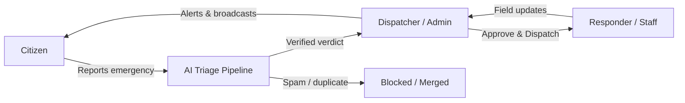
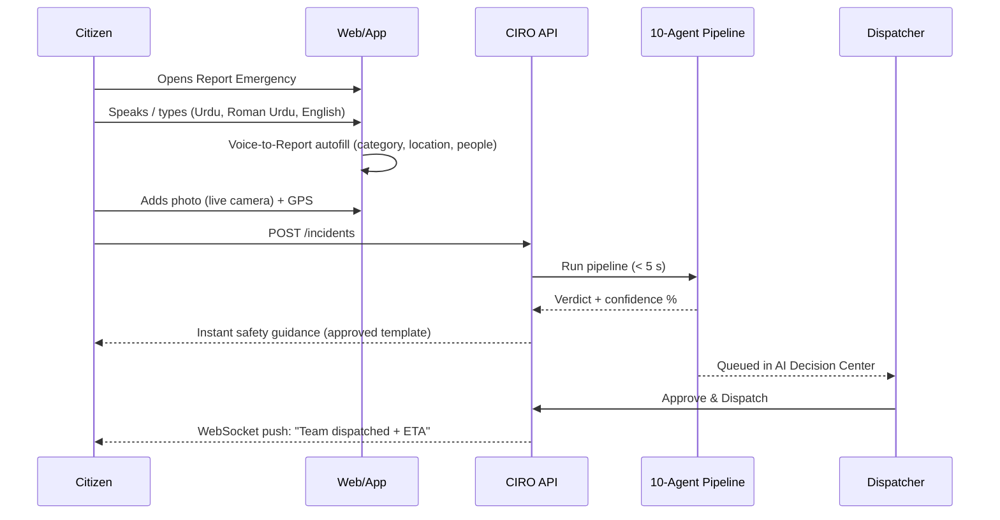
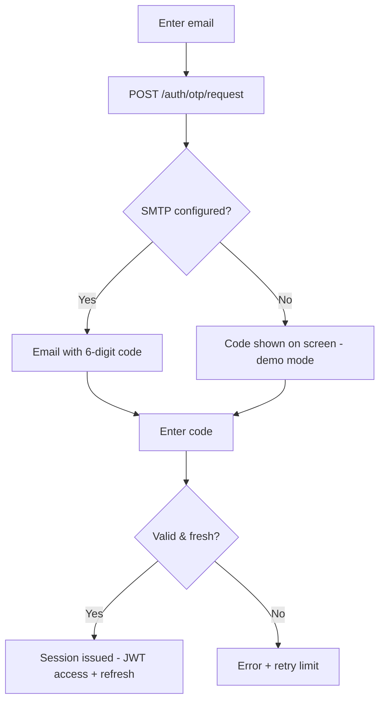
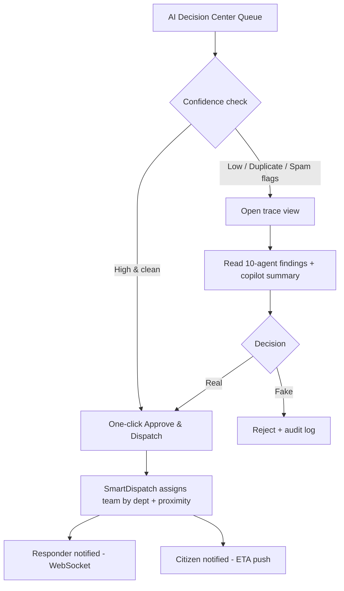
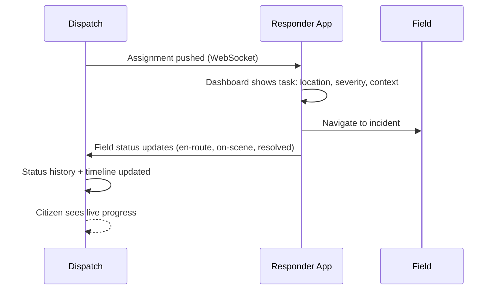
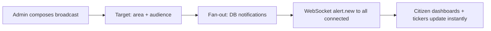
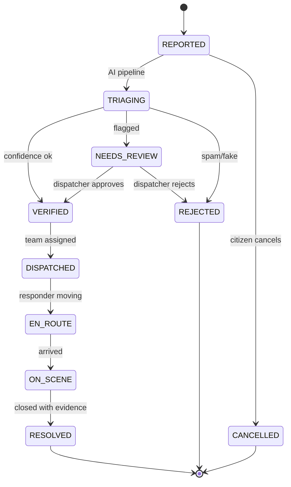

# CIRO — User Flows Document

> End-to-end journeys for every persona, with diagrams and step tables.

---

## Flow Map Overview

---

## 1. Citizen: Report an Emergency (Happy Path)

| Step | User Action | System Response |
|------|-------------|-----------------|
| 1 | Open Report Emergency | Form with 10 categories, voice & camera buttons |
| 2 | Speak in Urdu/Roman Urdu | Live transcription + AI autofill |
| 3 | Tap photo | Camera stream → capture → upload |
| 4 | Confirm location | GPS auto-fetch, editable |
| 5 | Submit | Incident `INC-YYYYMMDD-####` created, safety reply shown |
| 6 | Wait | Live timeline in My Reports; push on status change |

---

## 2. Citizen: Email OTP Sign-In

---

## 3. Dispatcher: Triage & Approve

| Queue | Meaning | Action |
|-------|---------|--------|
| NEEDS_REVIEW | SpamGuard ≥ 60 or conflicting signals | Manual verdict required |
| LOW_CONFIDENCE | VerdictEngine below threshold | Corroborate or reject |
| DUPLICATE | DedupGuard match | Merge into master incident |

---

## 4. Responder: Receive & Act

---

## 5. Admin: Emergency Broadcast

---

## 6. Role-Based Access Matrix

| Journey | PUBLIC | STAFF | ADMIN |
|---------|:------:|:-----:|:-----:|
| Report emergency | ✅ | ✅ | ✅ |
| View own reports | ✅ | ✅ | ✅ |
| Cancel own report | ✅ | ✅ | ✅ |
| Safety map / alerts / weather | ✅ | ✅ | ✅ |
| Assignments queue | ❌ | ✅ | ✅ |
| Field status updates | ❌ | ✅ | ✅ |
| Approve & dispatch | ❌ | ❌ | ✅ |
| Broadcasts / shelters | ❌ | ❌ | ✅ |
| User & staff management | ❌ | ❌ | ✅ |
| Audit logs | ❌ | ❌ | ✅ |

---

## 7. Incident Status Lifecycle

*(Full 14-state model with transition rules lives in `docs/BACKEND_SCHEMA.md`)*
