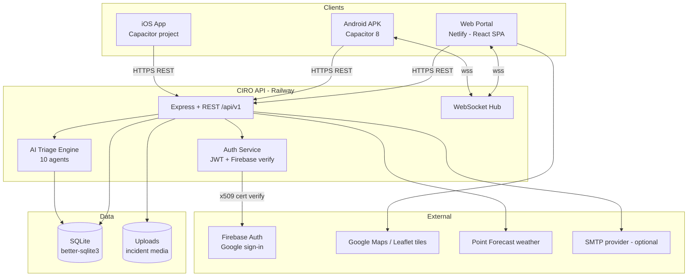
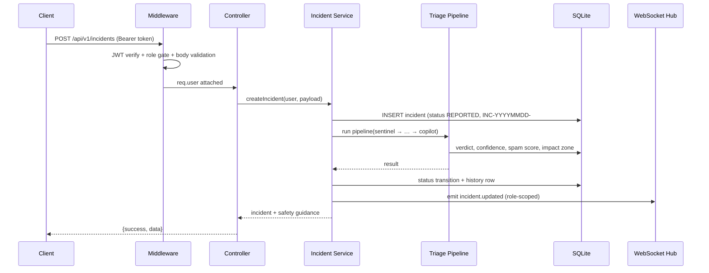
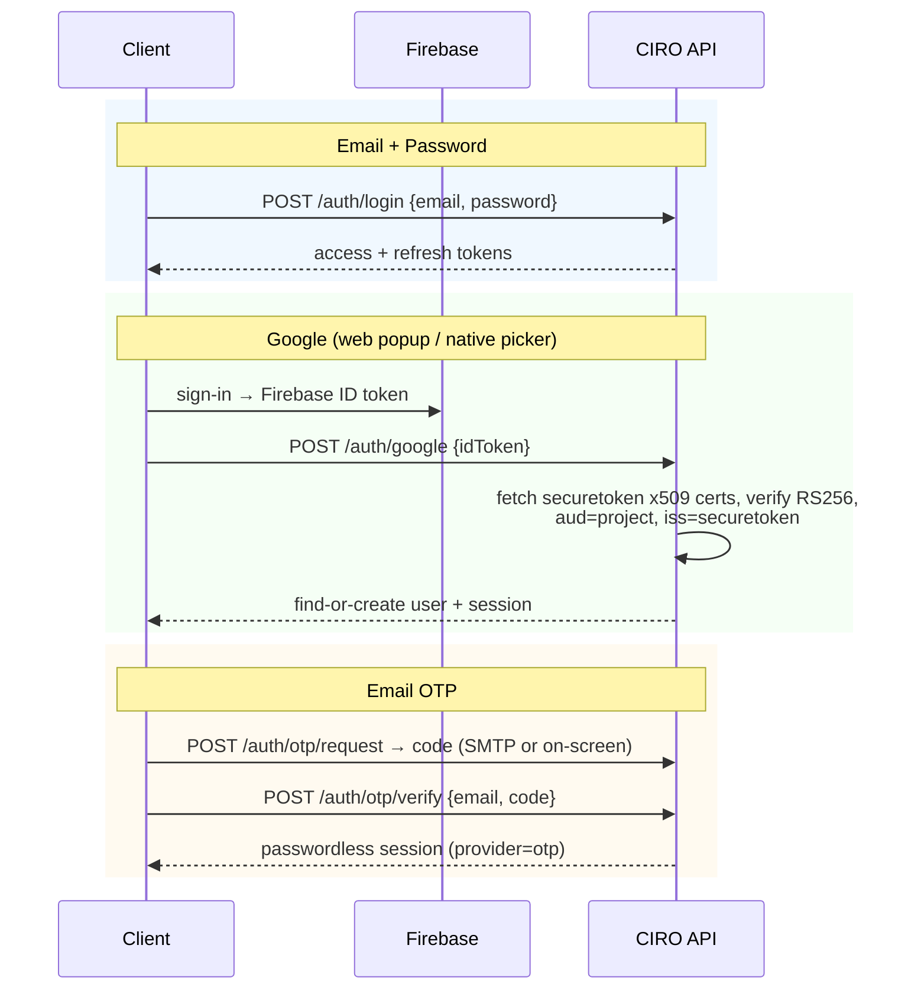
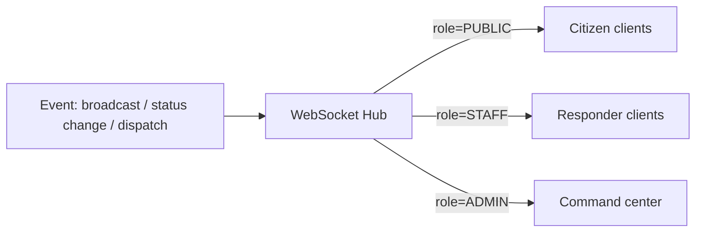

# CIRO — Technical Flow Document

> Architecture, data flows, API surface and deployment topology.

---

## 1. System Architecture



---

## 2. Tech Stack

| Layer | Technology | Why |
|-------|-----------|-----|
| Frontend | React 18 + Vite 5 + Tailwind CSS | Fast dev loop, tiny bundles |
| State | Zustand + TanStack Query | Minimal store + server-state cache |
| Maps | Leaflet (OpenStreetMap tiles) + Google Maps key | Free tiles, tactical dark mode |
| Backend | Node.js 20 + Express | Single-language stack |
| Database | SQLite via better-sqlite3 | Zero-ops, transactional, file-portable |
| Auth | JWT (access 15m / refresh 7d) + Firebase ID-token verification | Stateless + social login |
| Realtime | ws WebSocket hub | Sub-second alert fan-out |
| AI | Deterministic 10-agent pipeline (rule + scoring engines) | < 5 s, explainable, auditable |
| Mobile | Capacitor 8 (+ cordova-plugin-googleplus) | One web codebase → APK + iOS |
| Hosting | Netlify (site) • Railway (API) | Git-push auto-deploys |

---

## 3. Backend Layered Structure

```
server/src
├── routes/        11 modules → 82 endpoints (auth, incidents, admin, staff,
│                  ai, assistant, map, notifications, users, weather)
├── controllers/   HTTP ↔ service translation, envelope {success,message,data}
├── services/      business rules: auth, incidents, AI triage, mailer, websocket
├── repositories/  prepared-statement data access (SQLite)
├── middleware/    auth (JWT), RBAC (role gates), validation, uploads, errors
├── validators/    request schema checks
├── websocket/     connection registry + role-based fan-out
└── config/        env loading (PORT, JWT, SMTP, FIREBASE_PROJECT_ID…)
```

**Response envelope (every endpoint):**

```json
{ "success": true, "message": "…", "data": { } }
```

---

## 4. Request Flow — Incident Submission



---

## 5. Authentication Flow



**Refresh rotation:** access 15 min → `POST /auth/refresh` with rotating refresh token (7 d); reuse of a used refresh token revokes the family.

---

## 6. Realtime Fan-Out



Events: `alert.new`, `incident.updated`, `dispatch.assigned`, `notification.new`.

---

## 7. API Surface Summary

| Module | Endpoints | Highlights |
|--------|:---------:|------------|
| auth | 9 | login, register, google, otp request/verify, refresh, me |
| incidents | 14 | create, list (filters), detail, timeline, cancel, media |
| ai | 8 | triage trace, extract (voice autofill), verdict actions |
| admin | 22 | queue decisions, dispatch, broadcasts, shelters, users, audit |
| staff | 8 | assignments, field status updates, history |
| map | 6 | pins, zones, shelters, hotspots |
| notifications | 6 | list, read, mark-all |
| users | 4 | profile, avatar, preferences |
| weather | 3 | forecast, advisories |
| assistant | 2 | safety Q&A |
| **Total** | **82** | |

---

## 8. Database Schema (Core Tables)

| Table | Purpose |
|-------|---------|
| users | id, full_name, email, role, provider, avatar, prefs |
| incidents | number, category, status, severity, gps, confidence |
| incident_media | photos / evidence per incident |
| incident_status_history | full lifecycle audit |
| refresh_tokens | rotating sessions, revocation |
| otp_codes | hashed codes, expiry, attempts |
| notifications / emergency_broadcasts | fan-out records |
| shelters | safe-place registry |
| audit_logs | privileged action trail |

Schema & migrations: `server/database/migrations` • seed: `server/database/seeds/seed.js`

---

## 9. Deployment Topology

```mermaid
graph LR
    U[Users] --> N[Netlify CDN<br/>React SPA]
    U --> R[Railway<br/>Node API :8080]
    N -.runtime-config.json.-> R
    R --> S[(SQLite file)]
    subgraph Mobile
        A[APK / iOS] -.same runtime-config.-> R
    end
```

| Component | Host | Auto-deploy |
|-----------|------|-------------|
| Frontend | Netlify (base dir `client`) | GitHub push → build → publish |
| Backend | Railway (root dir `server`, Node 20) | GitHub push → nixpacks build |
| API URL switching | `public/runtime-config.json` — no rebuild needed | |
| Boot safety | server self-migrates + re-seeds empty DB on cold start | |

**Environment contract (backend):** `NODE_ENV, FRONTEND_URL, JWT_SECRET, JWT_REFRESH_SECRET, JWT_ACCESS_EXPIRES_IN, JWT_REFRESH_EXPIRES_IN, GOOGLE_MAPS_API_KEY, POINT_FORECAST_API_KEY, FIREBASE_PROJECT_ID` — host injects `PORT`.

---

## 10. Build Pipelines

| Artifact | Command chain |
|----------|---------------|
| Web | `npm run build` → `dist` → Netlify |
| APK | `npm run build` → `npx cap sync android` → `gradlew assembleDebug` (JDK 21 + foojay toolchain) |
| iOS | `npx cap sync ios` → Xcode workspace `client/ios/App/App.xcworkspace` |
