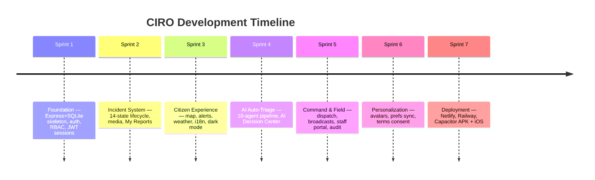
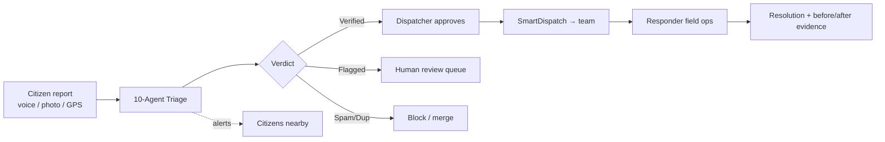

# CIRO — How We Built It

> The complete build story: specifications, engineering journey, impact,
> and what makes CIRO different.

---

## 1. The Problem We Set Out to Solve

| Pain point | Reality today |
|------------|---------------|
| Emergency reporting is slow | Phone calls, language barriers, unclear location |
| Control rooms drown in noise | Fake/spam/duplicate reports waste response time |
| Citizens get no feedback | "Report filed" — then silence |
| Responders get raw data | No verification, no context, no priority |
| Language exclusion | Urdu/Roman-Urdu speakers underserved by English-first systems |

**Our thesis:** an *AI-verified, human-approved* pipeline can compress report-to-dispatch
from **minutes to seconds** while keeping final authority with humans.

---

## 2. Product Specifications

| Spec | Target | Delivered |
|------|--------|-----------|
| Report-to-triage latency | < 10 s | **< 5 s** (10-agent pipeline) |
| Languages | Urdu, English, Roman Urdu | ✅ all three, runtime switch |
| Auth options | password + social + passwordless | ✅ all three |
| Portals | citizen, responder, command | ✅ 3 portals, 34 screens |
| Realtime | instant alerts | ✅ WebSocket fan-out |
| Mobile | Android + iOS | ✅ APK shipped, iOS project ready |
| API | REST, documented envelope | ✅ 82 endpoints |
| Human oversight | mandatory approval gate | ✅ audit-logged dispatch |
| Privacy | medical confidentiality | ✅ team-only impact zones |

---

## 3. Build Journey — Sprint by Sprint



### Key engineering decisions

| Decision | Rationale |
|----------|-----------|
| SQLite (better-sqlite3) | Zero-ops, single-file, transactional; migrations + auto-seed make any host boot-ready |
| Deterministic agent chain over black-box LLM | Explainable verdicts, < 5 s, no hallucinated dispatch, auditable per agent |
| Firebase ID tokens verified via x509 certs locally | tokeninfo endpoint rejects Firebase tokens — cert verification is the correct path |
| Runtime API URL (`runtime-config.json`) | Website/APK can switch backends without rebuild |
| Capacitor over native rewrite | One React codebase → web + APK + iOS; native plugins only for OS permissions & Google login |
| Approval gate before dispatch | Trust & legal safety: AI recommends, humans decide |

---

## 4. System Flow Summary



---

## 5. Impact

### For citizens
- Report in **their own language, by voice**, in under a minute
- Immediate safety guidance + live ETA and status timeline
- Area alerts and nearest safe places when danger is near

### For responders
- Only **verified, de-duplicated** assignments — noise filtered out
- Severity, location, impact-zone population and a copilot summary per incident

### For command centers
- Confidence-scored decision queues instead of raw call logs
- Hotspot forecasting to pre-position resources
- Full audit trail for accountability

### Measurable demo metrics

| Metric | Value |
|--------|-------|
| Triage latency | < 5 s |
| Spam auto-block threshold | score ≥ 40 blocked, ≥ 60 human review |
| Endpoint count | 82 |
| Screens | 34 across 3 portals |
| Supported languages | 3 |
| Deployment targets shipped | Web + APK (+ iOS project) |

---

## 6. How CIRO Is Different

| Dimension | Typical emergency apps | CIRO |
|-----------|------------------------|------|
| Verification | Manual triage or none | 10-agent AI chain with confidence scoring |
| Trust model | AI decides OR humans drown | **AI recommends, human approves** — audit-logged |
| Language | English-first | Urdu / Roman Urdu / English native support |
| Feedback loop | "Report filed" silence | Live timeline + ETA pushes |
| Spam handling | Post-hoc cleanup | SpamGuard + DedupGuard in-pipeline |
| Medical privacy | Often public | Team-only zones, hidden counts |
| Platform coverage | Web OR app | Same codebase: web + APK + iOS |
| Backend portability | Vendor-locked | Runtime-config switching; boots on any host with auto-migrate + seed |
| Explainability | Black box | Per-agent trace view for every verdict |

---

## 7. Challenges We Solved (Engineering Highlights)

| Challenge | Solution |
|-----------|----------|
| Firebase tokens rejected by tokeninfo | Local RS256 verification against Google securetoken x509 certs (1 h cache) |
| Google login impossible in WebView popup | Native account picker plugin → credential exchange → unchanged backend |
| Backend URL differs per platform | `runtime-config.json` loaded before app boot, with build-time fallback |
| Capacitor plugins need Java 21 | Foojay toolchain resolver + portable JDK for Gradle |
| Ephemeral-disk hosts losing DB | Boot-time migrate + conditional seed (`users = 0`) |
| CORS across web/APK origins | Comma-list allowlist with `*` reflection for mobile |

---

## 8. Roadmap

| Horizon | Item |
|---------|------|
| Now | SMTP (Resend/DirectMail) for real OTP emails; Alibaba Cloud ECS hosting |
| Next | SMS gateway fallback, push notifications (FCM), responder GPS tracking |
| Later | Satellite feed ingestion (MODIS/VIIRS), ML hotspot retraining, multi-city federation |

---

## 9. Repository Map

```
├── client/            React + Vite + Tailwind SPA (also Capacitor root)
│   ├── android/       Android project (APK builds)
│   ├── ios/           iOS project (Xcode workspace)
│   └── src/           34 screens, stores, i18n, API clients
├── server/            Express API (82 endpoints) + SQLite + seeds
├── docs/              PRD, TRD, APP_FLOW, BACKEND_SCHEMA
└── documentation/     This package (features, flows, presentation, screenshots)
```
