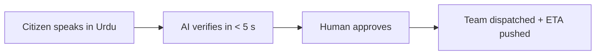
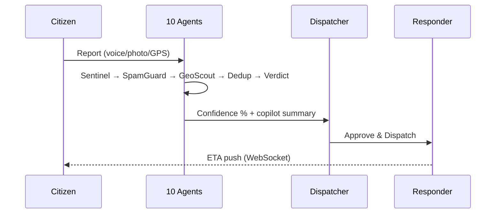

# CIRO — Hackathon Presentation

> **Alibaba Cloud × Bano Qabil Hackathon**
> Slide-by-slide deck (Markdown). Present in order; each section = one slide.

---

## Slide 1 — Title

# CIRO
### Crisis Intelligence & Response Orchestrator
**Secure. Connected. Human-led.**

One safety grid for Pakistan: citizens, responders and command centers
connected by an **AI-verified emergency pipeline** that reacts in seconds —
while **humans keep final authority**.

🌐 Live: https://ciroquick.netlify.app • 🤖 AI triage • 📱 Android APK + iOS ready

---

## Slide 2 — The Problem

| | |
|---|---|
| ⏱️ | Reporting takes **minutes** — phone calls, language barriers, vague locations |
| 🌊 | Control rooms drown in **noise** — spam, fakes, duplicates |
| 🤐 | Citizens get **zero feedback** after reporting |
| 🌍 | **Urdu / Roman-Urdu speakers** excluded by English-first systems |

> In an emergency, every second of verification delay costs lives.

---

## Slide 3 — The Solution

- 🗣️ **Voice-to-Report** — Urdu / Roman Urdu / English
- 🤖 **10-agent AI triage** — spam, duplicate, geo & satellite verification
- 👮 **Human approval gate** — AI recommends, dispatchers decide
- 📡 **Realtime** — citizens & responders updated live
- 📱 **Everywhere** — web + Android APK + iOS from one codebase

---

## Slide 4 — Live Demo Script (3 minutes)

| # | Show | Say |
|---|------|-----|
| 1 | Login (Google / OTP) | "Three ways in — passwordless OTP included" |
| 2 | Report Emergency → voice button | "Speak in Urdu — AI fills the form" |
| 3 | Submit | "Triage ran in under 5 seconds — instant safety reply" |
| 4 | Switch to Admin → AI Decision Center | "Confidence-scored verdict, one-click dispatch" |
| 5 | Staff dashboard | "Responder sees verified assignment instantly" |
| 6 | Citizen My Reports | "Live timeline + ETA — no more silence" |

**Demo accounts:** citizen@ciro.demo / Ciro@1234 • msaqibali433@gmail.com / saqib@23

---

## Slide 5 — How It Works

**The 10 agents:** Sentinel · SpamGuard · GeoScout · SatelliteScout · DedupGuard ·
Corroborator · VerdictEngine · GeoImpact · SmartDispatch · Copilot

---

## Slide 6 — Architecture

| Layer | Stack |
|-------|-------|
| Frontend | React 18 · Vite · Tailwind · Zustand · TanStack Query |
| Backend | Node 20 · Express · 82 REST endpoints · WebSocket hub |
| Data | SQLite (better-sqlite3) · self-migrating · auto-seed |
| AI | Deterministic 10-agent pipeline · explainable traces |
| Auth | JWT rotation · Firebase Google sign-in (web + native APK) |
| Mobile | Capacitor 8 → Android APK ✅ + iOS project ✅ |
| Hosting | Netlify (site) · Railway (API) · **Alibaba Cloud ready** |

---

## Slide 7 — Why Alibaba Cloud

CIRO is architected to run natively on Alibaba Cloud services:

| Need | Alibaba Cloud Service |
|------|----------------------|
| API hosting | **ECS** (network + security groups already provisioned via CLI) |
| OTP emails | **DirectMail** (SMTP drop-in — our mailer is provider-agnostic) |
| Evidence storage | **OSS** for incident photos |
| Scale-out DB | **ApsaraDB RDS** when SQLite outgrows a single node |
| CDN | **Alibaba Cloud CDN** in front of the web portal |
| AI extension | **PAI / Qwen** for future satellite-signal models |

> Our runtime-config system switches the API target with **zero rebuilds** —
> moving to Alibaba Cloud ECS is a config change, not a rewrite.

---

## Slide 8 — Differentiators

| Them | CIRO |
|------|------|
| Manual triage | 10-agent AI chain, < 5 s |
| Black-box AI | Per-agent explainable traces |
| AI decides alone | **Human approval gate**, audit-logged |
| English-first | Urdu · Roman Urdu · English |
| Report-and-forget | Live timeline + ETA pushes |
| Web OR app | Web + APK + iOS, one codebase |

---

## Slide 9 — Impact

- ⏱️ Report → verified dispatch: **minutes → seconds**
- 🧹 Spam & duplicates filtered **before** they reach humans
- 🗣️ First emergency platform speaking the citizen's language
- 🩺 Medical privacy preserved by design
- 🏙️ Hotspot forecasting to **pre-position** rescue resources

---

## Slide 10 — Team & Thanks

**Team CIRO** — Bano Qabil × Alibaba Cloud Hackathon

🌐 Live: https://ciroquick.netlify.app
📦 Repo: github.com/saqib54/Bano-Qabil-AlibabaCloud-Hackthon-CIRO-APP
📚 Docs: `documentation/` (features, flows, tech, screenshots)

### Thank you — questions welcome! 🙌
